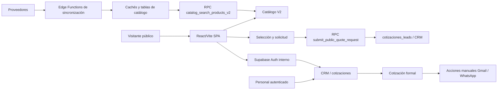

# ARQUITECTURA COMPROBABLE — EMOTIONAL PROMOS HUB

## Alcance

Este documento resume la arquitectura que puede comprobarse en el repositorio. No incluye secretos, valores de `.env`, credenciales ni afirmaciones sobre infraestructura externa que no estén versionadas.

## Vista general

## Frontend

Confirmado por `package.json`, `vite.config.ts`, `src/App.tsx` y la estructura de `src/`:

- React 18.
- Vite.
- TypeScript.
- React Router.
- Componentes UI basados en Radix/shadcn y Tailwind.
- React Query.
- Cliente tipado de Supabase.

Rutas principales:

- `/` — experiencia pública.
- `/login` — acceso del equipo.
- `/auth/update-password` — actualización de contraseña desde recuperación.
- `/crm/*` — aplicación CRM autenticada.

Rutas CRM comprobables:

- `/crm`
- `/crm/prospectos`
- `/crm/prospectos/:id`
- `/crm/cotizaciones`
- `/crm/cotizaciones/:id`
- `/crm/cotizaciones-formales`
- `/crm/cotizaciones-formales/:quoteId`
- `/crm/cotizaciones-formales/:quoteId/imprimir`
- `/crm/campanas`
- `/crm/mi-perfil`
- `/crm/configuracion`

## Git, GitHub y Lovable

- GitHub contiene el repositorio `mktoken/emotional-promos-hub`.
- Lovable es el entorno integrado de trabajo y publicación identificado por el proyecto `406ed62b-fa9a-4346-82b6-4b111a4193b3`.
- Git es la evidencia primaria del código.
- Lovable puede crear commits o planes automáticamente; su estado debe compararse con Git antes de integrar.
- La versión publicada en producción requiere validación específica; un commit presente en Git no demuestra por sí solo el despliegue.

## Supabase interno y Auth

El proyecto importa el cliente desde `src/integrations/supabase/client.ts` y usa Auth con:

- `persistSession: true`;
- `autoRefreshToken: true`;
- almacenamiento local o broker de preview según el entorno.

Supabase se trata como integrado dentro de Lovable. No se documentan aquí credenciales ni se asume un Dashboard externo.

Rutas y flujos Auth comprobables:

- login con `signInWithPassword`;
- logout con `signOut`;
- cambio de contraseña con `updateUser`;
- recuperación con `resetPasswordForEmail`;
- actualización en `/auth/update-password`.

## Datos, RPC y tablas relevantes

Las siguientes entidades aparecen en código, migraciones o QA versionado:

- `profiles` y `user_roles` para identidad y roles CRM;
- `cotizaciones_leads` y `articulos_cotizados` para solicitudes y productos;
- `catalog_price_cache` para caché pública Legacy;
- `catalog_price_cache_v2_generations` y `catalog_price_cache_v2_shadow` para generaciones y resultados shadow;
- `catalog_price_v2_releases` para el puntero de release V2;
- `proveedores` y `provider_import_batches` para proveedores e importaciones;
- tablas de productos y catálogo referenciadas por las migraciones y RPCs.

RPCs relevantes:

- `public.submit_public_quote_request`;
- `public.catalog_search_products_v2`;
- `public.get_public_product_price_quote`;
- `public.publish_catalog_price_v2_generation`;
- `public.rollback_catalog_price_v2_to_legacy`;
- `public.set_cotizacion_lead_follow_up`.

La matriz completa vigente de columnas, políticas RLS y grants no está consolidada en un documento único. Consultar migraciones y QA específicos antes de afirmar una configuración actual completa.

## Pricing y catálogo

- `CatalogView` usa la búsqueda V2.
- Pricing V2 tiene generaciones, shadow, release y rollback.
- Legacy se conserva como respaldo.
- La lógica de precio está en funciones/RPC y Edge Functions versionadas, no en una copia independiente del frontend.
- El estado operativo actual de stock y precios requiere validación específica; la arquitectura no equivale a confiabilidad comercial actual.

## CRM y cotizaciones

- El CRM se organiza bajo `src/features/crm`.
- Prospectos, cotizaciones, cotizaciones formales, campañas, perfil y configuración tienen páginas separadas.
- La cotización formal tiene edición, impresión/PDF y trabajos de impresión.
- Las acciones Gmail/WhatsApp son aperturas manuales preparadas desde la cotización; el envío y la entrega no forman parte de la evidencia validada.

## Proveedores y sincronizadores

Edge Functions versionadas relevantes:

- `sync-cdo-products` — proveedor `cdo_mx`;
- `sync-forpromotional-products` — proveedor `forpromotional`;
- `sync-g4-products` — proveedor `g4_mx`;
- `refresh-provider-stock` — coordina refrescos;
- `promote-provider-products-to-catalog` — promoción controlada;
- `test-cdo-connection`, `test-forpromotional-connection`, `test-g4-connection` — pruebas de conexión;
- `recompute-catalog-price-cache-v2` — recomputación V2;
- `capture-assistant-lead` y `send-proposal-summary-email` — funciones adicionales versionadas.

La fecha, salud y resultado de la última sincronización operativa de cada proveedor no están documentados como estado vigente.

## Preview frente a producción

- En preview Lovable, `previewAuthStorage.ts` puede intermediar la sesión mediante `postMessage` validado.
- Fuera de las zonas de preview, el cliente usa `localStorage`.
- Producción es `https://articulospromocionales.vip`.
- La validación de producción debe hacerse desde la URL publicada, no solo desde una preview.

## Límites conocidos

- No se documentan secretos ni credenciales.
- No se confirma desde este documento el estado actual de publicación de cada Edge Function.
- No se confirma aquí el estado actual de proveedores, stock, imágenes, fichas ni impresión.
- No se debe usar este documento para declarar un checkpoint cerrado.
