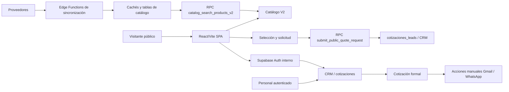

# ARQUITECTURA COMPROBABLE — EMOTIONAL PROMOS HUB

## Alcance

Este documento resume la arquitectura que puede comprobarse en el repositorio. No incluye secretos, valores de `.env`, credenciales ni afirmaciones sobre infraestructura externa que no estén versionadas.

## Vista general


```mermaid
flowchart LR
  V[Visitante público] --> SPA[React/Vite SPA]
  SPA --> CAT[Catálogo V2]
  SPA --> QUOTE[Selección y solicitud]
  QUOTE --> RPCQ[RPC submit_public_quote_request]
  RPCQ --> LEAD[cotizaciones_leads / CRM]
  STAFF[Personal autenticado] --> CRM[CRM / cotizaciones]
  CRM --> FORMAL[Cotización formal]
  FORMAL --> MANUAL[Acciones manuales Gmail / WhatsApp]
  SPA --> AUTH[Supabase Auth interno]
  AUTH --> CRM
  PROVIDERS[Proveedores] --> SYNC[Edge Functions de sincronización]
  SYNC --> CACHE[Cachés y tablas de catálogo]
  CACHE --> RPCP[RPC catalog_search_products_v2]
  RPCP --> CAT
```

## Frontend

Confirmado por `package.json`, `vite.config.ts`, `src/App.tsx` y la estructura de `src/`:

- React 18.
- Vite.
- TypeScript.
- React Router.
- Componentes UI basados en Radix/shadcn y Tailwind.
- React Query.
- Cliente tipado de Supabase.

Rutas principales:

- `/` — experiencia pública.
- `/login` — acceso del equipo.
- `/auth/update-password` — actualización de contraseña desde recuperación.
- `/crm/*` — aplicación CRM autenticada.

Rutas CRM comprobables:

- `/crm`
- `/crm/prospectos`
- `/crm/prospectos/:id`
- `/crm/cotizaciones`
- `/crm/cotizaciones/:id`
- `/crm/cotizaciones-formales`
- `/crm/cotizaciones-formales/:quoteId`
- `/crm/cotizaciones-formales/:quoteId/imprimir`
- `/crm/campanas`
- `/crm/mi-perfil`
- `/crm/configuracion`

## Git, GitHub y Lovable

- GitHub contiene el repositorio `mktoken/emotional-promos-hub`.
- Lovable es el entorno integrado de trabajo y publicación identificado por el proyecto `406ed62b-fa9a-4346-82b6-4b111a4193b3`.
- Git es la evidencia primaria del código.
- Lovable puede crear commits o planes automáticamente; su estado debe compararse con Git antes de integrar.
- La versión publicada en producción requiere validación específica; un commit presente en Git no demuestra por sí solo el despliegue.

## Supabase interno y Auth

El proyecto importa el cliente desde `src/integrations/supabase/client.ts` y usa Auth con:

- `persistSession: true`;
- `autoRefreshToken: true`;
- almacenamiento local o broker de preview según el entorno.

Supabase se trata como integrado dentro de Lovable. No se documentan aquí credenciales ni se asume un Dashboard externo.

Rutas y flujos Auth comprobables:

- login con `signInWithPassword`;
- logout con `signOut`;
- cambio de contraseña con `updateUser`;
- recuperación con `resetPasswordForEmail`;
- actualización en `/auth/update-password`.

## Datos, RPC y tablas relevantes

Las siguientes entidades aparecen en código, migraciones o QA versionado:

- `profiles` y `user_roles` para identidad y roles CRM;
- `cotizaciones_leads` y `articulos_cotizados` para solicitudes y productos;
- `catalog_price_cache` para caché pública Legacy;
- `catalog_price_cache_v2_generations` y `catalog_price_cache_v2_shadow` para generaciones y resultados shadow;
- `catalog_price_v2_releases` para el puntero de release V2;
- `proveedores` y `provider_import_batches` para proveedores e importaciones;
- tablas de productos y catálogo referenciadas por las migraciones y RPCs.

RPCs relevantes:

- `public.submit_public_quote_request`;
- `public.catalog_search_products_v2`;
- `public.get_public_product_price_quote`;
- `public.publish_catalog_price_v2_generation`;
- `public.rollback_catalog_price_v2_to_legacy`;
- `public.set_cotizacion_lead_follow_up`.

La matriz completa vigente de columnas, políticas RLS y grants no está consolidada en un documento único. Consultar migraciones y QA específicos antes de afirmar una configuración actual completa.

## Pricing y catálogo

- `CatalogView` usa la búsqueda V2.
- Pricing V2 tiene generaciones, shadow, release y rollback.
- Legacy se conserva como respaldo.
- La lógica de precio está en funciones/RPC y Edge Functions versionadas, no en una copia independiente del frontend.
- El estado operativo actual de stock y precios requiere validación específica; la arquitectura no equivale a confiabilidad comercial actual.
- El diagnóstico read-only de 2026-09-26 observó carga y paginación intermitentes. `CatalogView` deriva `page` desde la URL, calcula `p_offset` como `(page - 1) * 24` y actualiza los parámetros mediante `goToPage`; no se aisló una causa de código, red, sesión o RPC.

## CRM y cotizaciones

- El CRM se organiza bajo `src/features/crm`.
- Prospectos, cotizaciones, cotizaciones formales, campañas, perfil y configuración tienen páginas separadas.
- La cotización formal tiene edición, impresión/PDF y trabajos de impresión.
- Las acciones Gmail/WhatsApp son aperturas manuales preparadas desde la cotización. Existe evidencia E2E controlada de envío, recepción y PDF para `COT-2026-00008`; no debe extrapolarse a comunicaciones generales.

## Proveedores y sincronizadores

Edge Functions versionadas relevantes:

- `sync-cdo-products` — proveedor `cdo_mx`;
- `sync-forpromotional-products` — proveedor `forpromotional`;
- `sync-g4-products` — proveedor `g4_mx`;
- `refresh-provider-stock` — coordina refrescos;
- `promote-provider-products-to-catalog` — promoción controlada;
- `test-cdo-connection`, `test-forpromotional-connection`, `test-g4-connection` — pruebas de conexión;
- `recompute-catalog-price-cache-v2` — recomputación V2;
- `capture-assistant-lead` y `send-proposal-summary-email` — funciones adicionales versionadas.

La fecha, salud y resultado de la última sincronización operativa de cada proveedor no están documentados como estado vigente.

## Preview frente a producción

- En preview Lovable, `previewAuthStorage.ts` puede intermediar la sesión mediante `postMessage` validado.
- Fuera de las zonas de preview, el cliente usa `localStorage`.
- Producción es `https://articulospromocionales.vip`.
- La validación de producción debe hacerse desde la URL publicada, no solo desde una preview.

## Límites conocidos

- No se documentan secretos ni credenciales.
- No se confirma desde este documento el estado actual de publicación de cada Edge Function.
- No se confirma aquí el estado actual de proveedores, stock, imágenes, fichas ni impresión.
- No se debe usar este documento para declarar un checkpoint cerrado.

## Pricing de Conversión México — shadow mode

`src/lib/pricing-conversion-shadow.ts` implementa un functor puro de simulación. No importa el cliente Supabase, no ejecuta RPCs, no conoce rutas, no escribe cachés y no publica resultados. Su contrato recibe `source_cost`, un `provider_factor` solo para trazabilidad y/o `adjusted_cost` ya resuelto, más cantidad y observaciones opcionales.

La secuencia calculada es:

```text
source_cost → provider_adjustment → adjusted_cost → quantity → purchase_base
→ pricing_regime → internal_economic_price → market_reference
→ competitive_corridor → profitability_floor → recommended_price
```

`purchase_base` es `adjusted_cost × quantity`, antes de markup, impresión, IVA y envío. Los regímenes y límites son configurables: `SMALL_ORDER` desde `$1,500` hasta antes de `$5,000`, `MARKET_AWARE` desde `$5,000` y `ENTERPRISE` desde `$55,000`. La influencia de mercado usa una función continua entre `$4,500` y `$7,500`, sin un salto especial en `$5,000`.

El benchmark es una estructura para observaciones curadas de Compudat, Smart Promocionales, Artículos Promocionales de México y TodoPromocional. La normalización solo conserva mismo SKU, MXN, cantidad comparable, tratamiento homogéneo de IVA, sin impresión ni envío, observación vigente y stock razonable. Se calculan mínimo, P25, mediana, P75, máximo y conteo; la mediana es la referencia central configurable. No hay scraping ni observaciones inventadas en esta implementación.

El precio híbrido combina precio económico y referencia de mercado solo con datos suficientes. Sin benchmark suficiente, la salida conserva el precio interno y marca `market_adjustment_applied: false`. El piso configurable se aplica con `max(floor, hybrid)` y, si rebasa el corredor alto, el resultado se clasifica `NOT_COMPETITIVE` en lugar de ocultarlo. La salida incluye `shadow_only: true` y una comparación opcional contra Current V2; `calculate_product_price_v2` continúa siendo la autoridad pública.

Para enterprise la salida ya puede exponer precio recomendado, benchmark, piso, utilidad, margen y `discount_headroom` (la distancia utilizable sobre el piso cuando este existe). La interfaz `ConversionPricingTelemetry` reserva `quoted_price`, `benchmark_position`, `requested_discount`, `final_price`, `won/lost`, `loss_reason`, `gross_profit` y `lead_source` para una instrumentación futura, sin persistirlos ni aplicar ML en esta fase.

Los defaults de margen y corredor incluidos en el módulo son **SIMULATION DEFAULTS**, no una política comercial permanente. La activación requerirá una canasta competitiva mexicana curada, validación de parámetros, decisión de redondeo y un checkpoint posterior.

## CHK-AI-SALES-5 — capa visual y documentos comerciales

La capa visual del Super Agente usa `CommercialAttachment` en `src/features/agent/lib/agent-attachments.ts`. Soporta fotos, screenshots, inspiración, logos, arte, referencias competidoras y documentos comerciales simples. Cada archivo conserva tipo, nombre, MIME, tamaño, origen, fecha, estado de análisis, confianza, provenance, asociación a líneas y `humanReviewRequired`.

El intake acepta únicamente JPEG, PNG, WebP y PDF de hasta 10 MB, valida nombre seguro y no ejecuta contenido. Las observaciones explícitas conservan `OBSERVED`, `INFERRED`, `USER_CONFIRMED` o `UNKNOWN`; no se derivan SKU, precio, stock, Pantone, técnica, tintas, tamaño ni costo de impresión desde una imagen. Los logos y artes permanecen con revisión técnica requerida; una referencia competidora queda como contexto no autoritativo y no altera pricing.

El motor runtime visual del E2E QA usa Lovable AI Gateway con `openai/gpt-6-luna` en `/v1/responses`, `commercial_vision_v1`, `json_schema` estricto y validación Zod. El flujo es imagen → Edge Function segura → contrato V1 → normalización a `CommercialVisualAnalysis` → guard de query → catálogo real. La integración previa con Gemini y sus formas de respuesta variables queda como compatibilidad histórica/rollback; el campo heredado `analysisModel` no es autoridad para identificar el modelo ejecutado por la Edge Function.

Se separan dos entidades: un **pre-pricing candidate** se construye solo desde filas reales de catálogo y puede conservar `quantity=null`, `price=null` y stock no comprobado; no es un `AgentProduct` ni crea una product line. Con cantidad desconocida no se aplica filtro MOQ ni se ejecutan Pricing V2 o consulta de stock. Tras una selección explícita y una cantidad real que cumple MOQ, se hidrata el producto mediante herramientas existentes para consultar Pricing V2 y stock observado y, entonces, crear/seleccionar la línea comercial. No se selecciona automáticamente ningún candidato.

El E2E QA del 2026-09-29 validó visión → catálogo → selección → cantidad/MOQ → precio/stock → product line → Opportunity Context → oportunidad/cotización en `BORRADOR` → handoff humano. SKU/precio/stock siguen subordinados a catálogo/Pricing V2/autoridad de stock; la disponibilidad final y la impresión no se infieren desde visión. No hubo emisión ni comunicaciones. El PASS está acotado a este fixture QA y no implica lanzamiento público, cierre de QA para logo/competidor, ni adaptador WhatsApp de archivos.

## Operación Primero y Super Agente

La arquitectura operativa prioriza el flujo existente y separa la evolución futura:

- **P0/P1 operativo:** Home, catálogo, solicitud, CRM, cotización formal, PDF y seguimiento básico deben permanecer utilizables con la autoridad V2 actual.
- **Super Agente:** `src/features/agent/` contiene un núcleo determinista compartido por la ruta QA restringida en CRM y el piloto Web cliente local. CHK-AI-SALES-1/2/3 tienen E2E runtime QA validado; CHK-AI-SALES-3 incorpora product lines y cotización multilínea con catálogo, CRM, borrador y UI desktop/mobile comprobados. No existe un agente autónomo completo ni despliegue público del piloto.
- **Tres capas:** Sector Intelligence, Company Intelligence y Opportunity Context; cada dato debe conservar fuente, fecha y confianza.
- **Canales:** Web y WhatsApp comparten un único cerebro comercial; el canal no duplica reglas ni pricing.
- **Seguridad comercial:** sin precios inventados, sin activar Conversion Pricing, sin automatizar impresión no comprobada y con human handoff en el nivel inicial.

La baseline operativa, prioridades y estimaciones se mantienen en `docs/07_OPERATIONS_ROADMAP.md`.

## CHK-AI-SALES-1 — arquitectura del incremento QA

La ruta `/crm/agente-qa` se registra únicamente en builds con `VITE_ENABLE_AGENT_QA=true`; también exige sesión y rol comercial. Sin esa bandera el flujo público anterior permanece intacto. El estado de oportunidad vive en `sessionStorage` durante QA y puede transportar contratos de Sector Intelligence, Company Intelligence y Opportunity Context sin duplicar reglas por canal.

Las herramientas de lectura consultan `catalog_search_products_v2`, `productos_publicos` y `get_public_product_price_quote`. La UI muestra datos obtenidos, marca stock como observado o no comprobado y no usa `pricing-conversion-shadow.ts`. Las herramientas de escritura requieren rol comercial y contacto QA fijo; aprovechan `submit_public_quote_request` con UUID idempotente, guardan contexto en `cotizaciones_leads`, reutilizan o crean prospecto QA y preparan `formal_quotes` / `formal_quote_items` únicamente en `BORRADOR` y con precio autoritativo. El inicio de la escritura congela la sesión para permitir reintento con el mismo payload.

Límites del incremento original: no hay servidor conversacional, publicación de la bandera ni perfil empresarial persistente. Las escrituras QA, el E2E desktop/mobile y la UI piloto cliente local se validaron posteriormente en `CHK-AI-SALES-1-RUNTIME-1B` y `CHK-AI-SALES-2`; no equivalen a prueba general de permisos/RLS ni lanzamiento público. No se añadieron migraciones, Edge Functions, acciones automáticas de envío ni impresión.

## CHK-AI-SALES-2 — adaptador Web piloto

`agent-workflow.ts` concentra captura, búsqueda, selección, cambio de cantidad/variante y preguntas siguientes; `/crm/agente-qa` y `/agente-piloto` lo reutilizan junto con `agent-state.ts` y `agent-tools.ts`. El adaptador Web es local-only (`VITE_ENABLE_AGENT_WEB_PILOT=true` más hostname loopback), no indexable y sin enlace público; el build normal deja la ruta inactiva. Esto aísla el piloto, pero **no es un mecanismo de autorización**. El guard de escritura sigue exigiendo usuario y rol comercial en CRM y durante QA solo se admite contacto fijo controlado.

Antes de preparar el borrador, el piloto reconsulta producto, variante y precio autoritativo. `commitQaOperation` crea la oportunidad idempotente, reutiliza o crea el prospecto QA y guarda en el contexto de la oportunidad el ID del prospecto asociado; después crea únicamente una cotización `BORRADOR` y human handoff. Esta asociación evita sustituir `crm_leads.web_lead_id` cuando el prospecto QA ya apuntaba a una oportunidad anterior. Los IDs CRM y las trazas no se muestran en la UI compradora; el estado conversacional local sobrevive a recarga, pero no guarda allí IDs CRM. No hay acciones de emisión, correo o WhatsApp en el piloto.

Límites: no hay escritura CRM anónima ni backend conversacional público; el flujo de guardado es un piloto QA asistido por operador comercial. No se cambió RLS central, no se desplegó a producción y `CHK-BRAND-WEB-1` sigue siendo gate antes de lanzamiento público.

## CHK-AI-SALES-3 — contexto de oportunidad y cotización multilínea

`agent-state.ts` conserva compatibilidad con el snapshot v1 de una sola línea y migra la sesión local a `schemaVersion: 2`, con `productLines[]` y `activeProductLineId`. Cada línea mantiene consulta, candidatos reales, producto seleccionado, cantidad, variante/color, precio público V2, stock observado, estado comercial y personalización propia. El flujo compartido `agent-workflow.ts` resuelve categoría, cantidad, color y referencias a opciones; las referencias ambiguas no mutan una línea. Cada cambio de producto o cantidad repite la consulta de catálogo y precio para esa línea; un fallo local no borra las demás.

Las UIs `/crm/agente-qa` y `/agente-piloto` consumen el mismo panel de líneas. La vista calcula subtotales sin IVA por producto, IVA 16% y total con IVA; las líneas eliminadas no entran al borrador. El handoff conserva personalización y estados de precio/stock por línea. Las reglas de precio usan `get_public_product_price_quote`; Pricing de Conversión continúa fuera.

La escritura se mantiene restringida a sesión/rol comercial e identidad QA fija. Una sesión crea/reutiliza una oportunidad por `sessionId` con todas las líneas seleccionadas; al actualizar un borrador QA, el código verifica la identidad/sesión dueña, reconsulta precio V2 del producto seleccionado y reconcilia únicamente `formal_quote_items` con marcador QA por `lineId`, actualizando, insertando o quitando líneas propias y recalculando subtotal/IVA/total. El resto de partidas se rechaza como conflicto. La cotización permanece `BORRADOR`; no hay emisión, correo, WhatsApp, impresión automática, migraciones ni nueva autoridad de precio.

**Estado documentado:** **CERRADO / PASS**. Tests unitarios, tipos, lint dirigido y builds normal/QA PASS. El E2E local controlado validó catálogo real, tres líneas, sesión CRM, persistencia, oportunidad única, `COT-2026-00011` en `BORRADOR`, partidas/totales coherentes, recarga y QA visual desktop/mobile. Se corrigieron focalmente la captura de contexto multiproducto y la propagación del SKU público autoritativo. No se desplegó ni modificó producción.
